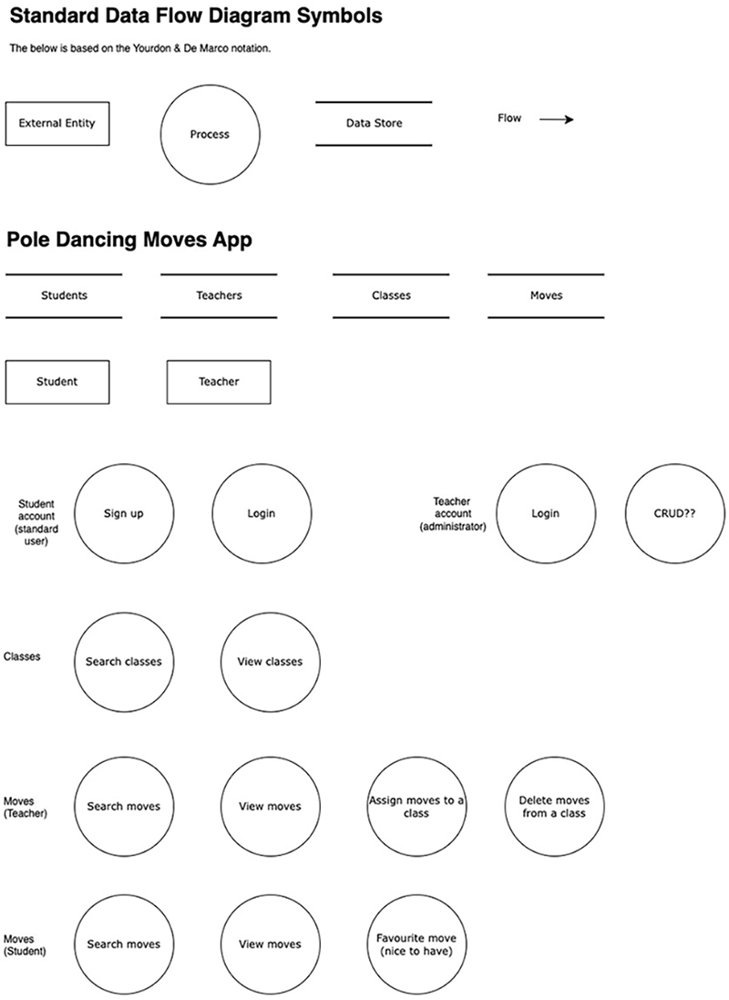
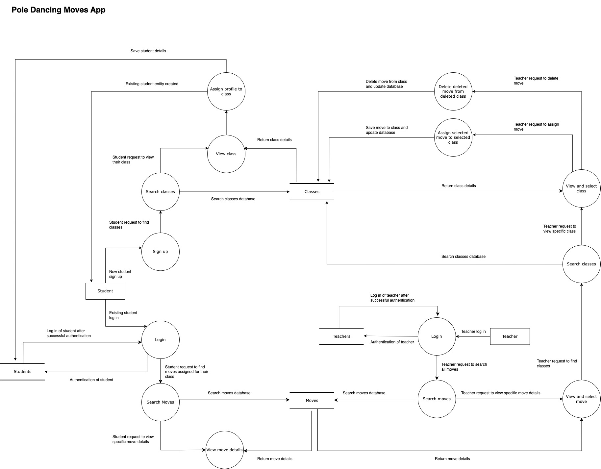

## Question 1: Description of your website

## Question 2: Data flow Diagram

<!--Diagram 1-->
  
<!--/Diagram 1-->

<!--Diagram 2-->
  
<!--/Diagram 2-->

## Question 3: Application Architecture Diagram

## Question 4: User Stories

## Question 5: Wireframes for multiple standard screen sizes, created using industry standard software

## Question 6: Screenshots of Trello Board

