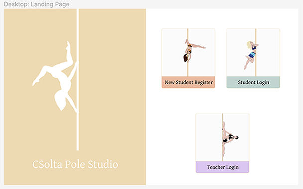

## Question 1: Description of your website

#### Problem and Solution (aka Purpose):

When it comes to yoga, there is a standard of move names. No matter where you are in the world, all students and teachers can identify the poses.

However, when it comes to pole fitness, move names vary wildly from studio to studio (with the exception of famous moves).

**Solution: Create a dictionary of pole moves with images and names.**

#### Target Audience:

This app will focus on a small studio in Brisbane, Csolta Pole Studio, that has mixed level classes. The target audience will be the teacher and students of Csolta. The teacher uses her phone to search for moves to teach but there is no history of moves she has taught. Furthermore, students can't remember what they have learnt and aren't able to search online because of the different names.

#### Functionality/Features:

##### Teacher

- Login as a teacher, who is also the administrator.
- Search for a move and view the list of moves.
- Add a move to a class.
- Delete a move from a class.

##### Student

- Login as a student.
- Search moves.
- View moves added to their class.

##### Nice to have:

- Allow students to mark moves as a 'favourite', and view the favourite moves under their profile.
- Add checkboxes for confidence level - a teacher can then use this information for future class planning

#### Tech Stack:

- MongoDB
- Express
- React
- React Bootstrap for styling
- Node.js

## Question 2: Data flow Diagram

## Question 3: Application Architecture Diagram

## Question 4: User Stories

## Question 5: Wireframes for multiple standard screen sizes, created using industry standard software

The time spent on phones vs time spent dancing. Pole fitness can be an expensive sport, with participants wanting to maximise their class time. Therefore, this app has to be functional yet minimal. Careful consideration and thoughtful planning is essential. Intended actions, simple functions, relationships between screens, spacing and content prioritisation are all at the forefront when designing this app.

As Corina explains:

Since this is an off-shoot of an original app idea, I (Corina) had to make sure that everything was out of my head and clearly set out on paper for someone else to view, understand, and develop alongside me.

Using Figma, I threw together the initial design to get the ball rolling. It was an efficient way for my teammate, Karla, to grasp the idea of what we're building. I started to get caught up with the designs and colours, charging full steam ahead. However,I remembered earlier projects where I was the designer and someone else was building from my designs. They told me:

"Look at the documentation of the framework/language we're going to be implementing and use that to do the designs. If you need a button and we're using Bootstrap, find a Bootstrap button. Or if you need a table and we're using Tailwind, find that table in their docs. These will be the Lego pieces that I'll use for building and know exactly where to look."

I take this one step further in that this will mean we'll be working within the limitations of the framework too. Hopefully reducing hacks or tricky workarounds to implement something that shouldn't exist while keeping customer expectations and experience at the forefront. For example, if Bootstrap React doesn't have tables; then we won't use tables in the design. That way, the customer won't ask for a feature that was in the design but was not built into the actual product. It keeps our code cleaner and delivers what was agreed upon, which is good for reputation and contractual agreements.

**Here is an updated design using Bootstrap React pieces:**

While the colours are the same, the rounded edges of the buttons are now reflective of the buttons found in React Bootstrap. Being a coder and/or designer, attention to detail is important. We're also operating on the mindset that whoever receives these designs can interpret and build them. Nothing will be left to assumption.

**Initial Design:**

The form buttons are mostly square with minimal rounding, there is a vague description of "maybe a drop-down selector instead of text-box?"" and a guess at mobile responsiveness.

**Using Bootstrap React Documentation:**

A specific component "Form Grid" is used, buttons are rounded, and there's a dropdown button to select student classes. There's no ambiguity and all \pieces exist in the documents. However, we can take some liberties with the styling. It would be nice to have "Name:" and the name input on the same line for aesthetic reasons but this can be fiddled with a bit later.
Since the studio currently doesn't have a logo or colour theme, we had the freedom to choose. As it is bright and airy inside, we went with a similar look and feel for the app.

**Student Colours:**

But, then we thought about what the teacher colours should look like so that it is distinctive from the student account but still keeps the same feel.

**Teacher Colours:**

We changed the primary colour to purple and left the rest as is because a lot of the components will be reused to keep our code DRY while also giving a connected feel to the app i.e. same app but different levels of access.

Sticking to the agile methodology, I asked my team mate Karla for feedback on the designs before I continued. She suggested instead of two separate login/sign up pages (one for teachers and one for students), we have a single landing page where there are four options that take users to the relevant page. This will eliminate the need for multiple URLs and become a single entity.

**Original Landing Page for Students for either Login or Create New Account:**

**Original Landing Page for Teachersfor either Login or Create New Account:**

**Completed Landing Page for all Users (mobile included):**

Since this is a mobile app, we decided to show the flow of the app by using bright green arrows and prototyping on the mobile designs. In Figma, I grouped together everything I could so that any changes based on feedback can be easily completed. However, a limitation of Figma is that elements can be grouped only so far and still work with prototyping. Therefore, clear labelling was essential.

The main functionality of the app is for a teacher to assign moves to a class and for students to view those moves. So, this was a priority and we had to make this as easy as possible. A teacher can either find moves in the different categories and add them to a class or they can look at the moves already in the class and add/remove moves from there. This dual way of editing content made for good user experience (UX).

Another point for UX was the spacing. The overall theme is "light and airy" to keep within the feel of the studio so there couldn't be too much functionality on each page. Furthermore, chalk covered fingers of teachers and students using the app meant we needed to be extra considerate of space. Therefore, we kept functionality minimal and avoided using side menus or nested navigation options. This may be an issue for future building if more pages are required. Menus are important for larger apps to make navigation simpler but we were happy to build this app without one due to its current size and size of the intended studio.

After many iterations and feedback from a few sources, the final designs are ready to be built.

## Question 6: Screenshots of Trello Board

